# AI Commander


A powerful, offline-capable CLI AI Agent that leverages Ollama’s local LLMs to generate—and even execute—Nushell commands for you. Save time, reduce context-switching, and let AI handle the nitty-gritty of terminal work. Created with ❤️ by Mycin.

---

## Table of Contents

1. [Overview](#overview)
2. [Why “AI Commander”?](#why-ai-commander)
3. [Features](#features)
4. [AI Workflow](#ai-workflow)
5. [Prerequisites](#prerequisites)
6. [Installation](#installation)
7. [Usage](#usage)
8. [Commands Cheat Sheet](#commands-cheat-sheet)
9. [Configuration & Models](#configuration--models)
10. [Limitations & Best Practices](#limitations--best-practices)
11. [Contributing](#contributing)
12. [License](#license)

---

## Overview

`AI Commander` is a **Nushell-focused** CLI tool that:

* **Generates** Nushell commands from your natural-language prompts.
* **Optionally runs** those commands automatically (if you trust the AI).
* Works **completely offline** using Ollama’s local LLMs—no internet, no shepherd from the cloud.
* Supports **multiple models**, letting you choose a smaller, faster model for casual tasks or a beefier one for complex scripting.

> “Remembering every single shell flag is so 2020. Let the AI handle that for you.”
> — Definitely not Darth Vader.

---

## Why “AI Commander”?

1. **Stop Googling syntax.**
   Tired of hunting for that obscure `ls` flag or `gcc` option? Let AI pick the right command.

2. **Offline & Free.**
   Because your data is your business. Ollama’s local models ensure privacy and zero bandwidth costs.

3. **Learn by Example.**
   Each generated command is a mini–tutorial. You’ll soon recognize patterns—“So that’s how `du | sort-by size` works!”

---

## Features

* 🎯 **Natural Language → Nushell**: Describe what you need in plain English, and AI Commander outputs the exact command.
* 🤖 **AI Agent Mode**: Automatically execute the generated Nushell command—no copy/paste required.
* ⚡ **Model Selection**: Pick from your installed Ollama models (e.g., `gemma3:1b`, `deepseek-r1:1.5b`, `llama3.2:latest`).
* 🔄 **Chaining & Complex Ops**: If a task needs multiple commands (compile & run, unzip & list), AI Commander will chain them—one per line, strict Nushell syntax.
* 🔍 **Dry Run & Flags**: Preview before executing (because AI occasionally “hallucinates” and types `rm -rf /` by accident—just kidding, it’s sanitised… mostly).
* 📦 **Single Binary Option**: Build an executable with PyInstaller for an ultra-streamlined experience.

---

## AI Workflow

```mermaid
flowchart TD
  A[📝 User Prompt] --> B[🤖 Select Ollama Model]
  B --> C[🔍 Parse Prompt & Compose Final System Prompt]
  C --> D[⚙️ API Call: Ollama LLM Generates Nushell Command]
  D --> E[🔄 Format & Validate Command]
  E --> F{❓ Run Mode?}
  F -->|Yes| G[▶️ Execute Command in Nushell]
  F -->|No| H[📋 Output Command Only]
  G --> I[📊 Show Output / Errors]
  H --> I[✅ End]
```



1. **User Prompt**
   You type: `commander gen "find all .log files and remove them"`.
2. **Select Model**
   AI Commander picks your configured Ollama model (e.g., `deepseek-r1:1.5b`).
3. **Parse & Compose**
   The prompt is sanitized and combined with a system message that enforces “strict Nushell command only” rules.
4. **Generate**
   Ollama’s LLM spins out a precise Nushell pipeline:

   ```
   ls *.log | where type == "file" | each { rm $it.name }
   ```
5. **Format & Validate**
   The tool checks for absolute paths, extra whitespace, or forbidden characters (spoiler: no backticks or markdown).
6. **Run?**

   * If you invoked `commander run`, it submits the command to your local Nushell shell.
   * If you used `commander gen`, it simply prints the command to STDOUT.
7. **Show & Done**
   You either copy & paste the command, or watch it execute live. No middleman.

> **Pro Tip:** Always double-check “destructive” commands (e.g., involving `rm`) before hitting Enter. AI Commander can’t read your mind when you say “wipe everything.”

---

## Prerequisites

Before rolling with AI Commander, ensure your system is up to snuff:

### System Requirements

* **Operating System**

  * Windows 10+ (PowerShell & Nushell installed)
  * macOS 10.14+ (Homebrew or downloadable Nushell binary)
  * Linux (Ubuntu 18.04+ / Fedora / Arch)

* **Python**: ≥ 3.11

* **Memory**: Minimum 4 GB RAM (8 GB recommended if running larger models)

* **Disk**: \~200 MB for the tool + additional 500 MB–3 GB per Ollama model, depending on size

### Software Dependencies

* **Ollama**:

  * Install from [ollama.com](https://ollama.com) (Windows: use the installer; macOS/Linux: use brew or official binary).
  * Ensure you have at least one model pulled (e.g., `ollama pull llama3.2:latest`).

* **Nushell**:

  * Install via [nushell.dev/install](https://www.nushell.dev/install).
  * Ensure that `nu` is in your `PATH`.

* **Package Manager**:

  * `pip` (preferred) or `poetry` or `pipx`/`uv`

---

## Installation

> “Installation is like cooking—follow the recipe and don’t burn the house down.”

1. **Clone the Repo**

   ```bash
   git clone https://github.com/mmycin/commander.git
   cd commander
   ```

2. **Environment Setup**

   * Copy `.env.sample` → `.env`
   * Edit `.env` and set:

     ```env
     PROCESS=DEVELOPMENT   # For local testing
     # or
     PROCESS=PRODUCTION    # For packaging and global use
     ```
   * Save the file.

3. **Install Dependencies**

   ```bash
   pip install -r requirements.txt
   ```

4. **(Optional) Build the Executable**

   *Only do this if you hate Python shebangs and want a single binary.*

   ```bash
   pyinstaller --onefile --name commander main.py
   ```

   This produces a single executable in `dist/` (add to your `PATH` for global use).
   You can also attach an icon if you’re feeling fancy:

   ```bash
   pyinstaller --onefile --icon assets/icon.ico --name commander main.py
   ```

---

## Usage

> **Warning:** If you accidentally ask AI Commander to `rm -rf .`, please don’t blame us. Double-check!

### Initialize

After installation, verify that `ollama` and `nu` are accessible:

```bash
commander --help
```

You should see:

```plaintext
Usage: main.py [OPTIONS] COMMAND [ARGS]...

Commander — An AI-powered CLI assistant built with Ollama's local LLMs.

It generates and executes terminal commands for specific tasks using natural language input. Let the AI
handle your shell work — securely, locally, and smartly.
Created by Mycin.

Options:
  --help  Show this message and exit.

Commands:
  gen      Generate a Nushell command from a natural-language prompt.
  run      Generate and execute a Nushell command.
  init     Initialize or switch Ollama model.
  model    Show current and available Ollama models.
  set      Change the active Ollama model.
```

#### `commander init`

```bash
$ commander init
Initializing Commander...
Available Models:
=================
1. gemma3:1b
2. deepseek-r1:1.5b
3. llama3.2:latest
Enter the model you want to use: deepseek
Model set to deepseek-r1:1.5b
```

* **Input**: Begin typing any portion of the model name (case-insensitive).
* **Behavior**: The tool picks the first unique match.

---

### Generate Only

```bash
commander gen "create a directory named hello"
```

* **Output**:

  ```
  mkdir hello
  ```

No extra fluff—just the raw command. Perfect for copy→paste or scripting.

---

### Generate & Run

```bash
commander run "search for all .log files in logs/ and delete them"
```

* **Generated**:

  ```
  ls logs/*.log | each { rm $it.name }
  ```
* **Executed**: AI Commander sends that pipeline to your Nushell shell. Watch the magic happen.

---

### Model Management

```bash
commander model
```

* **Example Output**:

  ```
  Current Ollama Model Name: deepseek-r1:1.5b

  Available Models:
  ================
  1. gemma3:1b
  2. deepseek-r1:1.5b
  3. llama3.2:latest
  ```

```bash
commander set llama
```

* **Output**:

  ```
  Model successfully set to: llama3.2:latest
  ```

Use the **first few letters** of a model (e.g., `gem`, `deep`, `llama`)—as long as it’s unambiguous. If it’s ambiguous, it will prompt you again.

---

## Commands Cheat Sheet

> “For those who like to live dangerously—always double-check AI suggestions!”

| Task                               | Prompt Example                          | Generated Command(s)                   |                       |
| ---------------------------------- | --------------------------------------- | -------------------------------------- | --------------------- |
| List all files (detailed)          | `list files`                            | `ls -al`                               |                       |
| Show only directories              | `list only directories`                 | \`ls`                                   | where type == "dir"\` |
| Create nested folders              | `make dir project/src/utils`            | `mkdir project/src/utils`              |                       |
| Compile & run a C program          | `run main.c`                            | `gcc main.c -o main` <br>`./main`      |                       |
| Move a file into `backup/`         | `move data.txt to backup`               | `mv data.txt backup/`                  |                       |
| Remove all `*.log`                 | `delete all .log files`                 | `rm -rf *.log`                         |                       |
| Count lines in `notes.txt`         | `how many lines in notes.txt`           | `open notes.txt \| lines \| length`    |                       |
| Show disk usage                    | `check disk usage`                      | `du`                                   |                       |
| Change permissions to 755 for a.sh | `make script.sh executable`             | `chmod +x script.sh`                   |                       |
| Search for "TODO" in `app.rs`      | `find TODO in app.rs`                   | `grep TODO app.rs`                     |                       |
| Zip the folder `logs/`             | `compress logs folder`                  | `zip -r logs.zip logs`                 |                       |
| Unzip `archive.zip`                | `extract archive.zip`                   | `unzip archive.zip`                    |                       |
| Initialize a Git repo              | `git init`                              | `git init`                             |                       |
| Clone repository from URL          | `clone repo https://github.com/foo/bar` | `git clone https://github.com/foo/bar` |                       |
| View `config.json`                 | `show config.json`                      | `open config.json`                     |                       |

> **Note:** The above commands are illustrative. AI Commander often suggests more efficient Nushell pipelines (e.g., `ls | where extension == "log" | each { rm $it.name }`).

---

## Limitations & Best Practices

1. **AI Isn’t Perfect**

   * Sometimes you’ll ask it to “delete all temporary files,” and it decides `rm -rf ./`. It’s rare, but **always read the generated command**.
   * When in doubt, use `commander gen` first, inspect the command, then copy/paste.

2. **Permissions & Safety**

   * AI Commander does **not** run with `sudo` privileges—don’t expect it to fix your root-owned files.
   * It tries to avoid dangerous patterns (no `rm -rf /` or `mv / /dev/null`), but still: be cautious.

3. **Model Knowledge Cutoff**

   * Ollama’s local models are “frozen” snapshots. If Nushell introduces new commands after your model’s training date, AI Commander may suggest outdated syntax.
   * To mitigate:

     1. **Update your model** (`ollama pull llama3.2:latest`)
     2. Blame your future self.

4. **Platform Differences**

   * Though Nushell aims for cross-platform consistency, minor variations (e.g., `ls` flags on Windows vs. Linux) may occur.
   * If AI-generated commands fail, tweak manually.

---

## Contributing

We love pull requests—especially for:

* **New prompt-to-command examples** (the more edge cases, the better!).
* **Model integration tests** (does `deepseek-r1` handle `du | sort-by` correctly? Let’s find out!).
* **Better error handling**—help us make “silent failure on violation” actually silent.
* **Documentation improvements**—you’re reading it; feel free to make it even shinier.

1. **Fork** the repository.
2. **Create** a new branch:

   ```bash
   git checkout -b feature/amazing-new-command
   ```
3. **Commit** your changes:

   ```bash
   git commit -m "Add example: search JSON for key 'user'"  
   ```
4. **Push** to your fork:

   ```bash
   git push origin feature/amazing-new-command
   ```
5. **Open** a Pull Request. We’ll review and (hopefully) merge it with maximum admiration.

> **Note:** We follow the “keep it fun” rule—treat others with kindness and respect. We promise not to reject your PR just because you used too many emojis (although we might ask you to dial it down to one per line).

---

## License

```
MIT License

Copyright (c) 2025 Mycin

Permission is hereby granted, free of charge, to any person obtaining a copy
of this software and associated documentation files (the “Software”), to deal
in the Software without restriction...
```

You know the drill—see `LICENSE` file for the full text.

---

> **Happy Commanding!**
> – Mycin, somewhere in Dhaka, with a cup of chai and too many open terminals.
